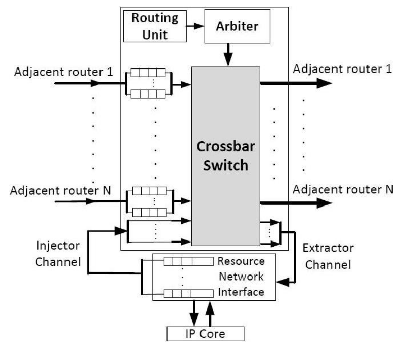
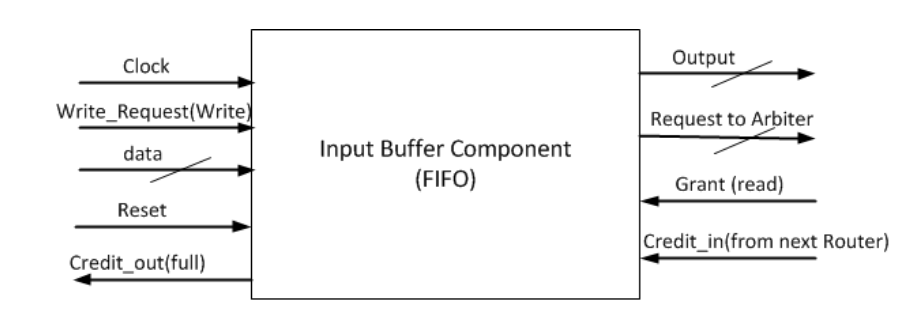
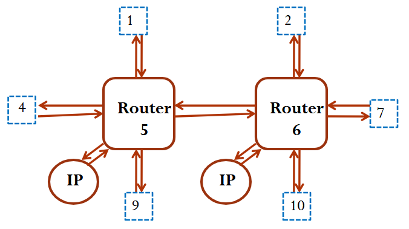

# 4×4 Mesh Network-on-Chip (NoC) Router Implementation

A comprehensive VHDL implementation of a Network-on-Chip router architecture and interconnections featuring credit-based flow control, round-robin arbitration, and XY routing algorithm for a 4×4 mesh topology.

## 🏗️ Project Overview

This project implements a complete NoC router system with the following key features:

- **4×4 Mesh Topology**: Scalable grid-based network architecture
- **Credit-Based Flow Control**: Prevents buffer overflow and ensures reliable data transmission
- **Round-Robin Arbitration**: Fair resource allocation among competing requests
- **XY Routing Algorithm**: Deadlock-free deterministic routing
- **Wormhole Switching**: Efficient packet transmission with header/tail flits
- **Network Interface**: Seamless integration with IP cores

## 📊 Architecture Diagram

```
    ┌─────────────────────────────────────────────────────┐
    │                  4×4 NoC Mesh                       │
    │                                                     │
    │  [0]──[1]──[2]──[3]                                 │
    │   │    │    │    │                                  │
    │  [4]──[5]──[6]──[7]                                 │
    │   │    │    │    │                                  │
    │  [8]──[9]──[10]─[11]                                │
    │   │    │    │    │                                  │
    │  [12]─[13]─[14]─[15]                                │
    │                                                     │
    └─────────────────────────────────────────────────────┘

    Router 5 (Node 5) ←→ Router 6 (Node 6) [Tested Pair]
```

## 🔧 Router Architecture

Each router consists of the following components:

### Core Components

| Component             | Description                     | Key Features                                                                  |
| --------------------- | ------------------------------- | ----------------------------------------------------------------------------- |
| **Input Buffers**     | FIFO buffers for each direction | 8-deep buffers (Dafault value, it is configurable), credit-based flow control |
| **Arbiter**           | Round-robin arbitration logic   | 11-state FSM, packet-aware scheduling                                         |
| **Crossbar Switch**   | 5×5 non-blocking switch fabric  | Full connectivity between all ports                                           |
| **Routing Unit**      | XY routing computation          | Deterministic, deadlock-free routing                                          |
| **Network Interface** | IP core integration layer       | Packet injection/extraction                                                   |

### Router Block Diagram



## 📁 Project Structure

```
NoC/
├── images/                                  # Image files for readme
├── src/
│   ├── packages/
│   │   └── ROUTER_PKG.vhd                   # Configuration package
│   └── modules/
│       ├── INPUT_BUFFER/
│       │   ├── FIFO_CONTROLLER.vhd          # FIFO control logic
│       │   ├── REGISTER_FILE.vhd            # Buffer storage (register file)
│       │   └── INPUT_BUFFER.vhd             # Input buffer wrapper
│       ├── CROSSBAR_SWITCH/
│       │   ├── CROSSBAR_MUX_LOCAL.vhd       # Local port multiplexer
│       │   ├── CROSSBAR_MUX_NORTH.vhd       # North port multiplexer
│       │   ├── CROSSBAR_MUX_EAST.vhd        # East  port multiplexer
│       │   ├── CROSSBAR_MUX_SOUTH.vhd       # South port multiplexer
│       │   ├── CROSSBAR_MUX_WEST.vhd        # West  port multiplexer
│       │   └── CROSSBAR_SWITCH.vhd          # 5×5 crossbar top-level
│       ├── ARBITER/
│       │   └── ARBITER.vhd                  # Round-robin arbiter FSM
│       ├── ROUTING_UNIT/
│       │   └── ROUTING_UNIT.vhd             # XY routing logic
│       ├── NETWORK_INTERFACE/
│       │   ├── EXTRACTOR_BUFFER.vhd         # Buffering packets that their destination is this router
│       │   └── NETWORK_INTERFACE.vhd        # NI top-level
│       ├── IP_CORE/
│       │   └── IP_CORE.vhd                  # Processing element interface
│       ├── ROUTER/
│       │   ├── ROUTER.vhd                   # Single router implementation
│       │   └── ROUTER_TB.vhd                # Single router testbench
│       └── ROUTERS_5_AND_6/
│           ├── ROUTERS_5_AND_6.vhd          # Connected routers testcase (in this project 5 and 6)
│           └── ROUTERS_5_AND_6_TB.vhd       # Comprehensive testbench
├── compile.tcl                              # Automated compilation script
├── simulation.tcl                           # Simulation launch script
└── README.md
```

## 🔧 Automation Scripts

### compile.tcl

Automated compilation script that handles all dependencies and compiles everything:

```tcl
# Create library and map it
vlib work
vmap work work

# Compile Packages First
vcom -2008 ./src/packages/ROUTER_PKG.vhd

# Compile Modules in dependency order
# INPUT_BUFFER components
vcom -2008 ./src/modules/INPUT_BUFFER/FIFO_CONTROLLER.vhd
vcom -2008 ./src/modules/INPUT_BUFFER/REGISTER_FILE.vhd
vcom -2008 ./src/modules/INPUT_BUFFER/INPUT_BUFFER.vhd

# CROSSBAR_SWITCH components
vcom -2008 ./src/modules/CROSSBAR_SWITCH/CROSSBAR_MUX_LOCAL.vhd
vcom -2008 ./src/modules/CROSSBAR_SWITCH/CROSSBAR_MUX_NORTH.vhd
vcom -2008 ./src/modules/CROSSBAR_SWITCH/CROSSBAR_MUX_EAST.vhd
vcom -2008 ./src/modules/CROSSBAR_SWITCH/CROSSBAR_MUX_SOUTH.vhd
vcom -2008 ./src/modules/CROSSBAR_SWITCH/CROSSBAR_MUX_WEST.vhd
vcom -2008 ./src/modules/CROSSBAR_SWITCH/CROSSBAR_SWITCH.vhd

# Other core modules
vcom -2008 ./src/modules/ARBITER/ARBITER.vhd
vcom -2008 ./src/modules/ROUTING_UNIT/ROUTING_UNIT.vhd
vcom -2008 ./src/modules/NETWORK_INTERFACE/EXTRACTOR_BUFFER.vhd
vcom -2008 ./src/modules/NETWORK_INTERFACE/NETWORK_INTERFACE.vhd
vcom -2008 ./src/modules/IP_CORE/IP_CORE.vhd

# Top-level modules and testbenches
vcom -2008 ./src/modules/ROUTER/ROUTER.vhd
vcom -2008 ./src/modules/ROUTER/ROUTER_TB.vhd
vcom -2008 ./src/modules/ROUTERS_5_AND_6/ROUTERS_5_AND_6.vhd
vcom -2008 ./src/modules/ROUTERS_5_AND_6/ROUTERS_5_AND_6_TB.vhd
```

Just run this in the modelsim commandline (make sure you are in the correct path!):

```tcl
do compile.tcl
```

### simulation.tcl

Simple simulation launcher:

```tcl
# Launch the main testbench with GUI
vsim -gui work.routers_5_and_6_tb
```

Just run this in the modelsim commandline (make sure you are in the correct path!):

```tcl
do simulation.tcl
```

At the end of simulation you can terminate that in the modelsim program or run this command at the modlesim commandline : quit -sim

## 🔬 Technical Specifications

### Network Parameters

- **Topology**: 4×4 mesh (16 nodes, Configurable)
- **Addressing**: 5-bit node addresses (Configurable)
- **Flit Width**: 12 bits (Configurable)
- **Buffer Depth**: 8 flits per input buffer (Configurable)
- **Routing Algorithm**: XY (dimension-ordered)
- **Flow Control**: Credit-based

### Flit Format

```
| Flit Type (2 bits) | Source Addr (5 bits) | Dest Addr (5 bits) |
|      [11:10]       |       [9:5]          |      [4:0]         |
```

**Flit Types:**

- `00`: Header flit
- `01`: Body flit (unused in current implementation)
- `10`: Tail flit
- `11`: Reserved

### Address Mapping

```
Node addresses are mapped as follows:
Row 0: [0] [1] [2] [3]     (Addresses: 0-3)
Row 1: [4] [5] [6] [7]     (Addresses: 4-7)
Row 2: [8] [9] [10][11]    (Addresses: 8-11)
Row 3: [12][13][14][15]    (Addresses: 12-15)
```

## ⚡ Key Features

### 1. Round-Robin Arbitration

The arbiter implements an 11-state FSM:

- **Request Check States**: 5 states for checking each input port
- **Grant States**: 5 states for granting access
- **Idle State**: 1 state for coordination

### Arbiter Diagram


### 2. Credit-Based Flow Control

- Prevents buffer overflow
- Credit signals indicate buffer availability
- Write requests coordinate data transmission

### inputbuffer Diagram



### 3. XY Routing Algorithm

```vhdl
-- X-direction first, then Y-direction
IF (dest_x < current_x) THEN
    route_direction := WEST;
ELSIF (dest_x > current_x) THEN
    route_direction := EAST;
ELSIF (dest_y < current_y) THEN
    route_direction := NORTH;
ELSIF (dest_y > current_y) THEN
    route_direction := SOUTH;
ELSE
    route_direction := LOCAL;  -- Destination reached
END IF;
```

### 4. Packet-Aware Scheduling

- Header flits establish routing paths
- Tail flits release resources
- Prevents packet fragmentation

## 🧪 Testing & Verification

### Test Configuration: Routers 5 & 6

The project includes a comprehensive testbench focusing on routers 5 and 6 connectivity:

### Testbench Module Diagram



#### Test Cases Implemented:

1. **Node 1 → Node 9** : North-to-South routing through Router 5
2. **Node 7 → Node 4** : East-to-West routing through Routers 6→5
3. **Node 10 → Node 1**: South-to-North routing through Routers 6→5
4. **Node 9 → Node 2** : South-to-North routing through Routers 5→6
5. **Simultaneous Multi-Path**:
   - Node 6 → Node 1 (Local injection)
   - Node 10 → Node 9 (Transit traffic)
   - Node 2 → Node 9 (Transit traffic)

#### Router 5 ↔ Router 6 Interconnection

```vhdl
-- Direct connections between adjacent routers
ROUTER5.EAST_DATA_OUT    → ROUTER6.WEST_DATA_IN
ROUTER6.WEST_DATA_OUT    → ROUTER5.EAST_DATA_IN
ROUTER5.EAST_CREDIT_OUT  → ROUTER6.WEST_CREDIT_IN
ROUTER6.WEST_CREDIT_OUT  → ROUTER5.EAST_CREDIT_IN
ROUTER5.EAST_WR_REQ_OUT  → ROUTER6.WEST_WR_REQ_IN
ROUTER6.WEST_WR_REQ_OUT  → ROUTER5.EAST_WR_REQ_IN
```

## 🚀 Usage Instructions

### Prerequisites

- ModelSim/QuestaSim or compatible VHDL simulator
- VHDL-2008 support
- TCL scripting capability

### Quick Start (Automated)

The project includes automated TCL scripts for easy compilation and simulation:

#### 1. Compile Project

```bash
# Navigate to project root directory
cd NoC

# Run compilation script
do compile.tcl
```

#### 2. Run Simulation

```bash
# After successful compilation, run simulation
do simulation.tcl

# Or manually specify testbench
vsim -gui work.routers_5_and_6_tb
```

### Manual Setup

#### 1. Library Setup

```tcl
vlib work
vmap work work
```

#### 2. Compilation Order

The `compile.tcl` script follows proper dependency order:

```tcl
# 1. Packages first
vcom -2008 ./src/packages/ROUTER_PKG.vhd

# 2. Low-level components
vcom -2008 ./src/modules/INPUT_BUFFER/FIFO_CONTROLLER.vhd
vcom -2008 ./src/modules/INPUT_BUFFER/REGISTER_FILE.vhd
vcom -2008 ./src/modules/INPUT_BUFFER/INPUT_BUFFER.vhd

# 3. Crossbar components
vcom -2008 ./src/modules/CROSSBAR_SWITCH/CROSSBAR_MUX_*.vhd
vcom -2008 ./src/modules/CROSSBAR_SWITCH/CROSSBAR_SWITCH.vhd

# 4. Higher-level modules
vcom -2008 ./src/modules/ARBITER/ARBITER.vhd
vcom -2008 ./src/modules/ROUTING_UNIT/ROUTING_UNIT.vhd
vcom -2008 ./src/modules/NETWORK_INTERFACE/EXTRACTOR_BUFFER.vhd
vcom -2008 ./src/modules/NETWORK_INTERFACE/NETWORK_INTERFACE.vhd
vcom -2008 ./src/modules/IP_CORE/IP_CORE.vhd

# 5. Top-level modules and testbenches
vcom -2008 ./src/modules/ROUTER/ROUTER.vhd
vcom -2008 ./src/modules/ROUTER/ROUTER_TB.vhd
vcom -2008 ./src/modules/ROUTERS_5_AND_6/ROUTERS_5_AND_6.vhd
vcom -2008 ./src/modules/ROUTERS_5_AND_6/ROUTERS_5_AND_6_TB.vhd
```

#### 3. Available Simulations

```tcl
# Router 5 & 6 interconnection test (recommended)
vsim -gui work.routers_5_and_6_tb

# Single router test
vsim -gui work.router_tb
```

### 3. Configuration

Modify `ROUTER_PKG.vhd` for different configurations, You can easliy change every measures of this project in this file to meet requirements of your project:

```vhdl
-- Network dimensions
CONSTANT ROWS    : INTEGER := 4;
CONSTANT COLUMNS : INTEGER := 4;

-- Buffer depth
CONSTANT BUFFER_DEPTH : INTEGER := 8;

-- Node addresses (example)
CONSTANT NODE5_ADDRESS : NETWORK_ADDR := "00101";
CONSTANT NODE6_ADDRESS : NETWORK_ADDR := "00110";
```

## 📈 Performance Characteristics

### Latency Analysis

- **Minimum Latency**: 3 clock cycles (no contention)
  - 1 cycle: Input buffer → Arbiter
  - 1 cycle: Arbitration decision
  - 1 cycle: Crossbar switching
- **Additional Latency**: +1 cycle per hop in network
- **Arbitration Delay**: Up to 5 cycles under heavy contention

### Throughput

- **Peak Throughput**: 1 flit/cycle per output port
- **Sustainable Throughput**: Depends on traffic patterns and network load
- **Buffer Utilization**: 8 flits × 5 input ports = 40 flits total per router

## 🔄 Flow Control Mechanism

### Credit-Based Protocol

1. **Credit Initialization**: Each input buffer starts with available credits
2. **Credit Consumption**: Credits decremented when flits are sent
3. **Credit Return**: Credits returned when flits are consumed from buffers
4. **Backpressure**: Transmission halts when no credits available

```vhdl
-- Credit signal semantics
CREDIT_SIGNAL = '0'  -- Buffer space available
CREDIT_SIGNAL = '1'  -- Buffer full/no space
```

## 🛠️ Customization Options

### 1. Network Size

Modify topology by changing `ROWS` and `COLUMNS` constants:

```vhdl
CONSTANT ROWS    : INTEGER := 6;  -- For 6×6 mesh
CONSTANT COLUMNS : INTEGER := 6;
```

### 2. Buffer Depth

Adjust buffer size for different latency/area trade-offs:

```vhdl
CONSTANT BUFFER_DEPTH : INTEGER := 16;  -- Deeper buffers
```

### 3. Routing Algorithm

Replace XY routing with other algorithms in `ROUTING_UNIT` component.

### 4. Arbitration Policy

Modify arbiter FSM for different scheduling policies (priority-based, weighted round-robin).

## 📋 Future Enhancements

- [ ] **IP Core**: Adding a fully-functional IP core to the project
- [ ] **Virtual Channels**: Multiple virtual channels per physical channel
- [ ] **Adaptive Routing**: Dynamic path selection based on network conditions
- [ ] **Quality of Service**: Priority-based packet handling
- [ ] **Fault Tolerance**: Redundant paths and error recovery
- [ ] **Power Management**: Clock gating and dynamic voltage scaling
- [ ] **Full 4×4 Mesh**: Complete 16-router network implementation

## 🔍 Debugging Tips

### Common Issues

1. **Routing Loops**: Verify XY routing implementation
2. **Credit Deadlock**: Check credit initialization and return logic
3. **Arbitration Starvation**: Ensure proper round-robin advancement
4. **Buffer Overflow**: Validate credit-based flow control

## 👥 Contributing

1. Fork the repository
2. Create a feature branch (`git checkout -b feature/new-feature`)
3. Commit changes (`git commit -am 'Add new feature'`)
4. Push to branch (`git push origin feature/new-feature`)
5. Create Pull Request

## 📄 License

This project is licensed under the GNU GENERAL PUBLIC LICENSE V3.0, So feel free to use it or modify it or anything else you want ;)

---

**Project Status**: ✅ Router Implementation Complete | ✅ Inter-router Connectivity Tested | 🔄 IP Core In Progress

For questions or contributions, please open an issue or submit a pull request.
